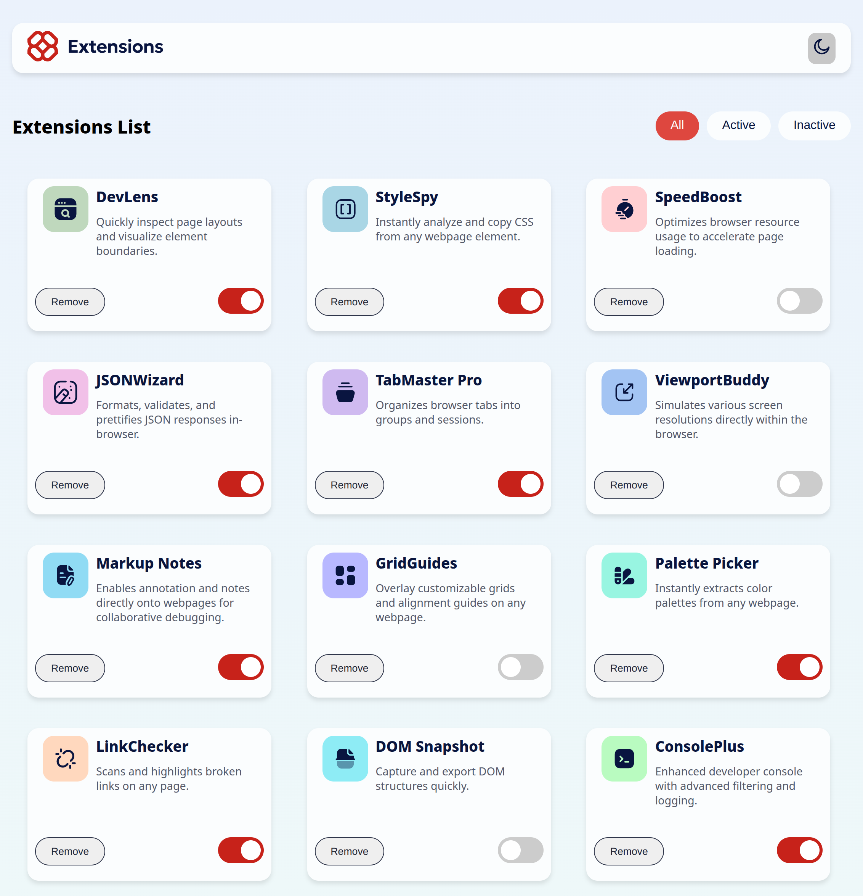

# Frontend Mentor - Browser extensions manager UI solution

This is a solution to the [Browser extensions manager UI challenge on Frontend Mentor](https://www.frontendmentor.io/challenges/browser-extension-manager-ui-yNZnOfsMAp). Frontend Mentor challenges help you improve your coding skills by building realistic projects.

## Table of contents

- [Overview](#overview)
  - [The challenge](#the-challenge)
  - [Screenshot](#screenshot)
  - [Links](#links)
- [My process](#my-process)
  - [Built with](#built-with)
  - [What I learned](#what-i-learned)
  - [Continued development](#continued-development)
- [Author](#author)
- [Acknowledgments](#acknowledgments)

## Overview

### The challenge

Users should be able to:

- Toggle extensions between active and inactive states
- Filter active and inactive extensions
- Remove extensions from the list
- Select their color theme
- View the optimal layout for the interface depending on their device's screen size
- See hover and focus states for all interactive elements on the page

### Screenshot



### Links

- Solution URL: [solution URL ](https://github.com/nickonyi/Browser-extensions-manager-ui-.git)
- Live Site URL: [live site URL ](https://browser-extensions-manager-ui-indol.vercel.app/)

## My process

### Built with

- Semantic HTML5 markup
- CSS custom properties
- Flexbox
- CSS Grid
- Mobile-first workflow
- [React](https://reactjs.org/) - JS library
- [Styled Components](https://styled-components.com/) - For styles

### What I learned

Working on this challenge helped me improve my understanding of managing state in React when handling toggle features and filters. I also deepened my knowledge of building responsive layouts using CSS Grid and media queries.

Here's a sample of the toggle function I used in React:

```js
const toggleExtension = (id) => {
  setExtensions((prev) =>
    prev.map((ext) => (ext.id === id ? { ...ext, active: !ext.active } : ext))
  );
};
```

### Continued development

In future projects, I’d like to focus more on:

- Improving accessibility (ARIA roles, screen reader support)
- Animating state transitions (e.g., toggles and removal)
- Using a global state management tool like Redux or Context API

## Author

- Frontend Mentor - [@nickonyi](https://www.frontendmentor.io/profile/nickonyi)
